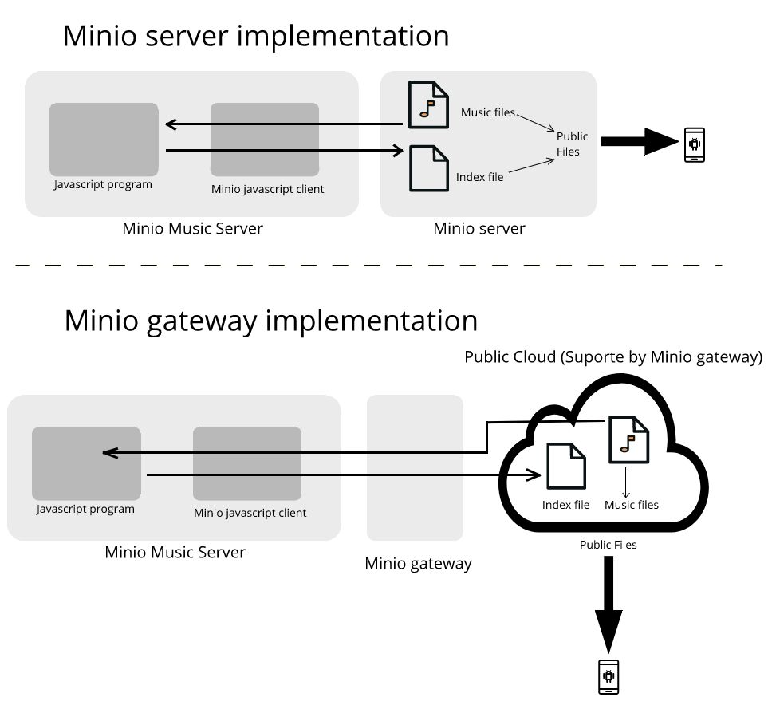

# minio_Music_Server
Minio music Server is a nodejs program to control a music library with metadata in a Minio storage with automatic index creation.

Is not a server in the strict sense, because the server is Minio, or the cloud storage that host the music.

The idea is that you have your Music Library copied to a Object Storage Server or Minio server (just a bunch of .mp3, flac, ogg, wav, etc.), files in any folder structure), then the Music Server program indexed all data and extract metadata from the music. This indexed library can be accessed from an Android and then you can download the data that you want.

The program works with Minio as a server and Amazon S3 storage in a direct way, but you can configure Minio Azure Gateway, Minio GCS (google cloud storage) or BackBlaze B2 to serve the music files. The difference is that in Minio it detects the changes in the music Library. With S3 and Minio Gateways you run the program each time the library changes to reindex the music library.

The final result of this program is to make the index file. example: "music.index".  Optionally, you can choose encryption, and all of the multimedia files and index file get encrypted. You can delete de unencripted files and the index file gets the link to the encrypted version. 

In this repository directories you can find the old version (procedural Version and obsolete version) of the program. The program was re engineered to be reactive using only data flows with the help of Kefir.js library.

Because I was not acustom to think in a reactive functional form, I want to tell that it was hard to find wich is the way for FRP - functional reactive programing, and I found that is not easy but the final code result is less messy to understand.

I made an Android program called MMEClient, to read the index and download multimedia data from your Minio server. (Android program is in developer stage, free version available)

If you have some storage in the cloud that can work with direct links you can use Minio Music Server. You can also create by hand the "music.index" file and use the MMEClient Android program to search/download music files. To see a description of the "Music.index" file [here](doc/indexDescription.md)

CLoud Storages that are proven and worked with the MMEClient are: Minio, Azure object storage, Google CLoud Storage, Amazon S3, PCloud (Direct Links enabled with Public access ), BackBlaze B2.

So you have plenty of options for storing your files. Each cloud provider have special and different procedures to enable direct links and anonymous public access. Encrypted files are very useful when you use a public cloud and public access, so you don't expose your files. These files are public but the only way to know what is inside is decrypting them with your own key.

To know more about enable encrytption [here](doc/encryption.md)

MMEClient can use more than one (1) cloud provider, and has no limit in the number of files, it also works with encrypted files.

Check in Android Google Play.

https://play.google.com/store/apps/details?id=com.mundocreativo.javier.mmeclient

Thanks to:

Music-Metadata javascript:  https://github.com/borewit/music-metadata#readme

Minio Javascript Client api: https://docs.min.io/docs/javascript-client-api-reference.html

Minio Server configuration: https://docs.min.io/docs/minio-quickstart-guide.html

----------------------
### Server installation:

1. Install a working Minio instance. ( https://min.io/ ) S3 compatible storage.
2. Copy your music library to a bucket in the Minio Instance. (To access music from the Minio server to the android program you have to make the bucket public)
3. In any server, or PC you can install Node (Nodejs) 6 version or newer. (now I have node 10 version)

Check version

  **node --version**

4. Copy the node server program - minio_Music_server by cloning repository or copy javascript files from the github repository (*.js , *.json) to your working directory (any directory for the javascript program)
5. Configure access to minio in the file inicio.js .  change in accordance to your configuration.

#### inicio.js

Select S3 or Minio with:

    const minio = true  //--- true for Minio, false fo Amazon S3 or a Minio gateway.
    const SCAN_METADATA = true  //--- false for only read the basic data from directory listing, no metadata but is very fast because doesn't need to read all files for extracting metadata
                                //--- true for read all file and extract metadata information
    const ENCRYPTED = false    //--- True for encrypted index database, False no encryption
    var PASSWORD = "0123456789012345" //--- Has to be exact 16 characters 

//--- Configuring Globals USE for Minio

    var bucket = "test"                     //--- name of the bucket
    var pathMusic = "music/"                //--- path to the music library that you want to index
    var indexFileName = "music.index"       //--- leave a music.index (default)
    var minioClient = new Minio.Client({
        endPoint: '192.168.0.8',            //--- IP of the Minio Music Server where the music library lives
        port: 9000,                         //--- Port of the Minio server (9000 is default)
        useSSL: false,                      //--- without SSL, put true for SSL access
        accessKey: 'admin',                 //---  Minio server Access key
        secretKey: 'password'               //---  Minio server Secret Key
    });

----------------

    //--- Configuring Globals USE for S3  Comment in case you have Minio
    var bucket = "mipublico"                     //--- name of the bucket
    var pathMusic = "music/"                     //--- path to the music library that you want to index
    var indexFileName = "music.index"            //--- leave a music.index (default)
    var minioClient = new Minio.Client({
        endPoint: 's3.amazonaws.com',            //--- IP of Amazon
        accessKey: 'XXXXXXXXXXX',       //---  Amazon server Access key
        secretKey: 'XXXXXXXXXXXXXXXXXXXXX'   //---  Amazon Secret Key
    });

----------------    
6. From the command line in the path of your working directory run

    **npm install**

7. run javascript program

    **node inicio.js**

8. Make any change to the Music library to see if the music.index file appears in the bucket.
9. You can delete or put any mp3 file or directory to see the change in the music.index file (this file shows the updates after 30 seconds of inactivity in the minio server)
----------------------

To access your Media library use MMEClient for Android, check that your files in the storage has anonymous and public access (Very important for MMEClient)

To see how to setup a freenas [here](doc/freenas.md)

To see my functional reactive programing toughts [here](doc/reactive.md)

