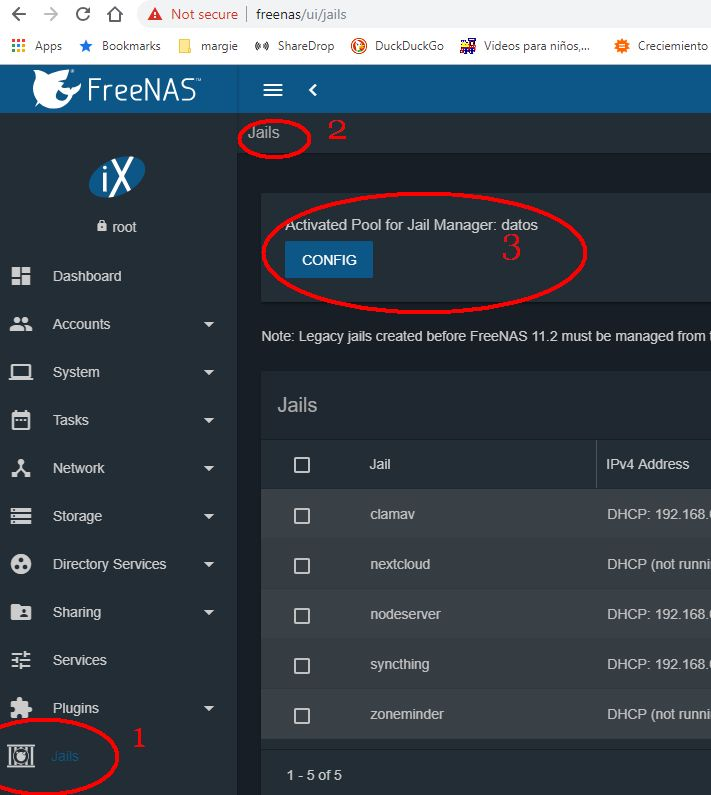
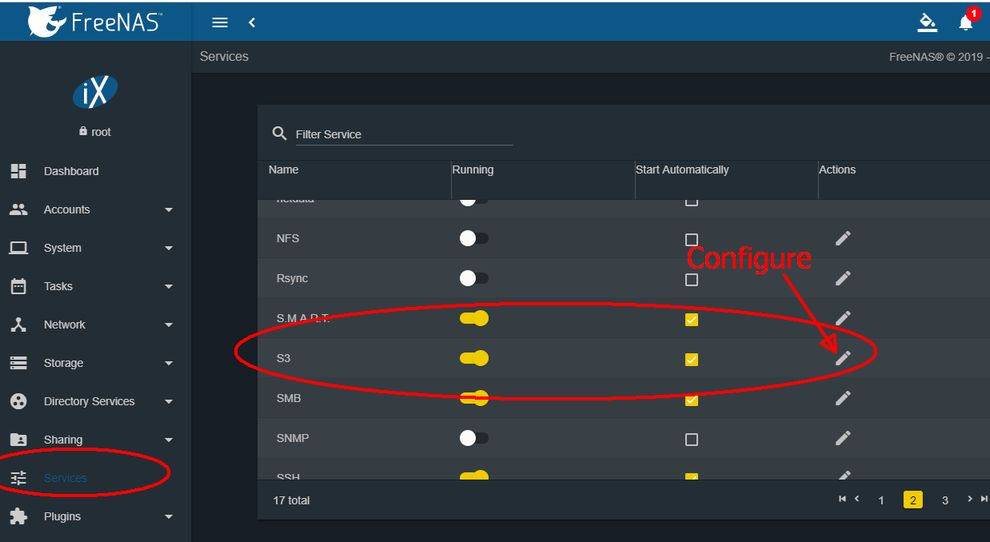
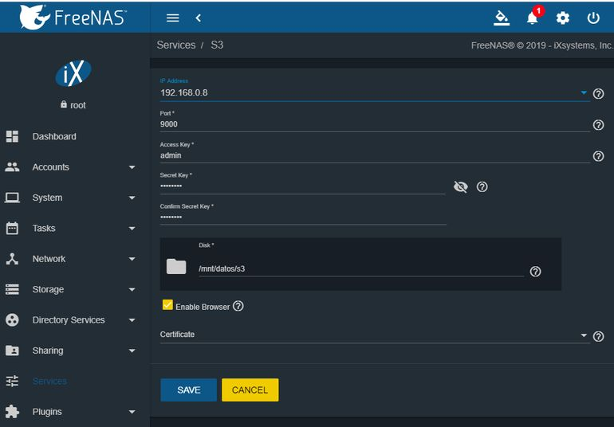
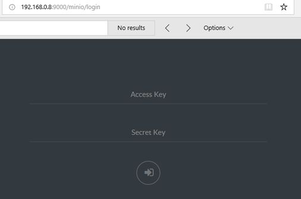
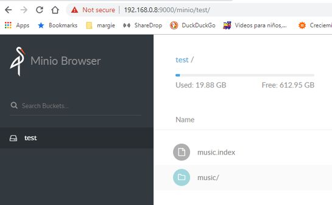
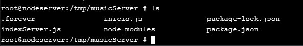
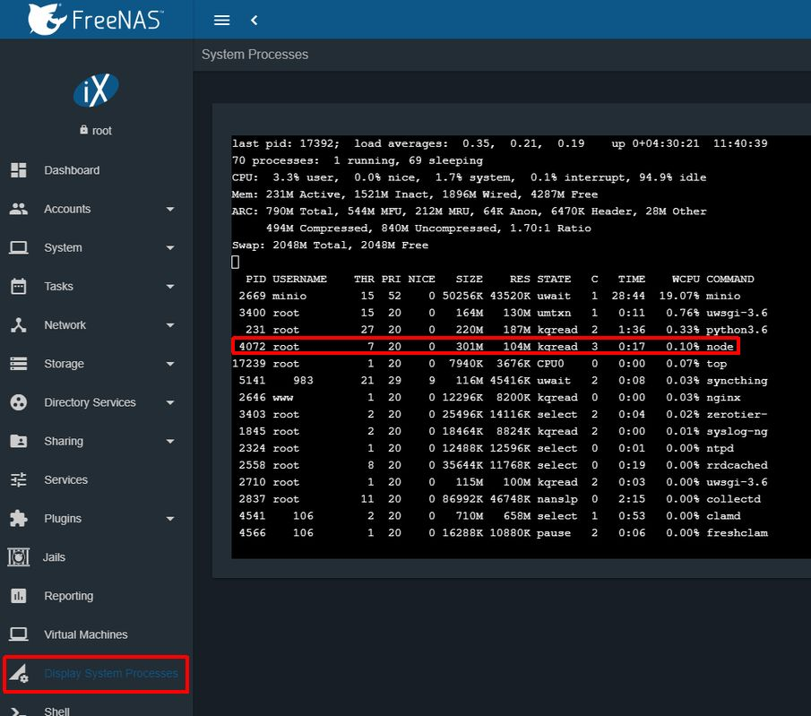

# minio_Music_Server
Minio music Server is a nodejs program to control a music library with metadata in a Minio storage with automatic index creation.

The idea is that you have your Music Library copied to a Minio server (just a bunch of .mp3 files in any folder structure), then the Minio Music Server program indexed all metadata from your music library when it detects a change in the library. The index is in a NDJSON format.

I made a Android program to read the index and download music from your Minio server. (Android program is in developer stage, free version available)

Thanks to:

Music-Metadata javascript:  https://github.com/borewit/music-metadata#readme

Minio Javascript Client api: https://docs.min.io/docs/javascript-client-api-reference.html

Minio Server configuration: https://docs.min.io/docs/minio-quickstart-guide.html

----------------------
### Server installation:

1. Install a working Minio instance. ( https://min.io/ ) S3 compatible storage.
2. Copy your music library to a bucket in the Minio Instance. (To access music from the Minio server to the android program you have to make the bucket public)
3. In any server you can install Node (Nodejs) 6 version or newer. (now I have node 10 version)

Check version

  **node --version**

4. Copy the node server program - minio_Music_server by cloning repository or copy javascript files from the github repository (*.js , *.json) to your working directory (any directory for the javascript program)
5. Configure access to minio in the file inicio.js .  change in accordance to your configuration.

#### inicio.js

Select S3 or Minio with:

    const S3 = true  //--- false for minio, true fo Amazon S3

//--- Configuring Globals USE for Minio

    var bucket = "test"                     //--- name of the bucket
    var pathMusic = "music/"                //--- path to the music library that you want to index
    var indexFileName = "music.index"       //--- leave a music.index (default)
    var minioClient = new Minio.Client({
        endPoint: '192.168.0.8',            //--- IP of the Minio Music Server where the music library lives
        port: 9000,                         //--- Port of the Minio server (9000 is default)
        useSSL: false,                      //--- without SSL, put true for SSL access
        accessKey: 'admin',                 //---  Minio server Access key
        secretKey: 'password'               //---  Minio server Secret Key
    });

----------------

    //--- Configuring Globals USE for S3  Comment in case you have Minio
    var bucket = "mipublico"                     //--- name of the bucket
    var pathMusic = "music/"                     //--- path to the music library that you want to index
    var indexFileName = "music.index"            //--- leave a music.index (default)
    var minioClient = new Minio.Client({
        endPoint: 's3.amazonaws.com',            //--- IP of Amazon
        accessKey: 'XXXXXXXXXXX',       //---  Amazon server Access key
        secretKey: 'XXXXXXXXXXXXXXXXXXXXX'   //---  Amazon Secret Key
    });

----------------    
6. From the command line in the path of your working directory run

    **npm install**

7. run javascript program

    **node inicio.js**

8. Make any change to the Music library to see if the music.index file appears in the bucket.
9. You can delete or put any mp3 file or directory to see the change in the music.index file (this file shows the updates after 30 seconds of inactivity in the minio server)
----------------------

## Notes: Configuration of a Minio server in a freenas

**Freenas**  ( https://freenas.org/ ) is an opensource operating system based in a Freebsd operating system that you can use to host a Minio instance. In the version 11.2-U3 you can start a Minio instance as a service, you don't have to create aditional VM or Jail to start Minio.

I have an old machine that I use for my Freenas server.

The specs for my freenas box are:

Intel core 2 Quad CPU Q9450 @2.66GHz (4 cores)

8 GB RAM

2x1TB HDs in mirror for data as a ZFS Pool

Remember that you neet to have a Pool for Jail Manager Activated

To activate Minio as a Service

### Go to Services for configuration and Start S3.

### In configuration check that you have a valid Ip Address, could be the same that you use for accesing console

Once you start S3 service (Minio) you can go to a web browser an go to **IPADDRESS:9000** that get you to:

You can use the Minio Browser to put the Music Library (Bunch of .mp3 files) in a new Bucket

------------

## Notes: Configure your freenas to start a nodejs program in a jail using Foreverjs

The idea is that Nodejs program is in a jail that is run automatically each time that your machine is started.

1. Create a Jail in your Freenas server. (The jail needs a IP) normal Jail no special requirements.
2. Install node.  ( https://computingforgeeks.com/how-to-install-node-js-10-lts-npm-on-freebsd-12/ )
3. Install forever

**npm install forever -g**

4. Configure the service in forever to run automatically each time the jail is started as a service.

    Use the script from (https://github.com/rwestlund/node-rc)

    I create a file named **musicminio** in /usr/local/etc/rc.d with the content in the file you can check in [musicminio](/freenas/musicminio)

    Check that have execution rights.

    **ls -l**

    to enable execution rights run:

    **chmod 777 musicminio**

    copy the program files (*.js , *.json) from this repository to: /tmp/musicServer (this is your working directory for this program)

    

    You can see inicio.js, indexServer.js and package.json

    Run **npm install**

    You can see the creation of **node_modules** directory.

    Then enable the service to run.

    **vi /etc/rc.conf**

    You need to add the line

 

To check that the service you have to go to the path **/usr/local/etc/rc.d/**

Then run the command:

**service musicminio start**

Check that if you copy a .mp3 file to your minio server the index gets recreated.

Also you can check that the service is running going to **Display System Process** in Freenas console

------

