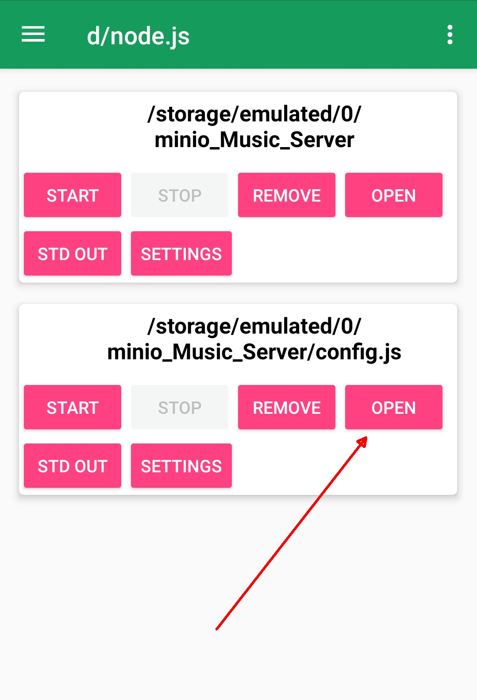

# Running in Android

With __Dory - Node.js__ is it possible to run __Minio_music_server__ in Android directly. Is not the best idea but is possible.

## Why is not a good idea ? ##
If you have the music library in the cloud in Amazon S3 for example, you need to first put the Music file in the cloud, (Could be possible to do with any compatible S3 android software like __MMe Connections__ free in Android [Link:](https://play.google.com/store/apps/details?id=com.mundocreativo.javier.mmeconnections&hl=en)), then run Minio Music Server in the Android device, that internally bring the song to the Android device, extracts metadata, and if the sing requires encryption has to be uploaded encrypted. So The  music data has to be transported three (3) times from the Android device to the storage. Usually Android runs in Wi-fi and the information travels over Internet so the speed is not so good and could be expensive because uploading and downloading can incure in costs.

If you run the Min.io server local, the idea is to have the node server running __Minio_music_server__  as you can see for example in freenas here: To see how to setup a freenas [here](../doc/freenas.md) like a daemon to make all this stuff automatically so is not need to be running from Android device. If you have Min.io in Linux or Windows, you can also have a resident instance of node.js running __Minio_music_server__ point to your min.io server indexing the music library.

## Why could be a good idea ? ##
If you don't have any cloud server that can run nodejs, and your storage is in the cloud in a free tier you can use the Android solution at no cost. (Only wifi, because some cell phone data providers can charge for data)

But if you want to test by yourself you could try.

The documentation about __Dory - node.js__ is not so good but once you understand what is the logic of the program it is easy.

To run

1. Download and install Dory - node.js  [Link:](https://play.google.com/store/apps/details?id=io.tempage.dorynode&hl=en)

2. Then you have to update the node version. It for default comes with node v6.11.4 In the information on the description of the download page you can see the different versions that you can install.

To check the version, enter to the shell in the menu to the right and select __Shell__.

Write __node -v__ in the console, check the version, and then close with the __X__

## To update the version: ##

But is not easy to understand the instructions. It said: __'download file' menu -> check 'appfiles' -> check 'executable'__

From the Menu to the right select -> __Download file__

I use the  https://dorynode.firebaseapp.com/v8.9.4_arm_release/node version

Then copy the link of the node version that we need and put in the URL field, and check __Appfiles__ and __executable__ as the following image, leave __path__ as the image and then __OK__ to update.

Then check the version of node again after the update in the __Shell__.

Close the __Shell__

3. Then download from github the __Minio_music_server__ program.

First get the repository link copied ready to be pasted in Android, then in __Dory - Node.js__ app in the menu to the right select __git clone__

Hit __OK__, and the repositorie get clonned.

Now you need to open the local copy of the repository with the __+__ red floating button at the right bottom of the screen.

Tab the __Add directory(package.json's main)__ icon.

and select the directory where you put __minio_music_server__

You can check the __package.json__ file with open. To exit hit __back__ in Android. 

4. Configure your instance of __Minio_music_server__

Then you need to configure the parameters of __Minio_music_server__ in accordance to your configurations. Opening the file __config.js__.

With __+__ red floating button at the right bottom of the screen. Select __Add File__ and search for __config.js__ file.

Then you have to edit the file with __Open__

Change the fields to configure __Minio_music_server__ .

As you can see my Storage is in Amazon, you can use these parameters and change your bucket and keys.

Then save in the menu to the right and hit __Save__, and back in Android.

5. Run __Minio_music_server__

Hit the __Start__ button of the package and check the results with __STD OUT__ button.

In __STD OUT__ you can check the results.

---END---