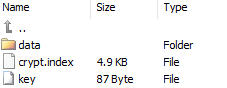
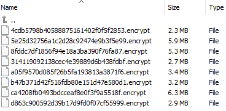

## Encryption in Minio Music Server

Because if you want to host your library in a public cloud that has good advantage like availability, low maintenance you sacrifice confidentiality, is a good option to encrypt all your media library.

To encrypt your library is necesary to recreate the index file, so you need to delete this file first. Then Enable encryption in Minio Music server and run the program again.

To enable encryption you need to set these two fields, ENCRYPTED as true, set a PASSWORD and choose a keyFileName (Default for MMEclient is "key")

    let encrypted = true                    //--- True for encrypted index database, False no encryption
    let keyFileName = "key"                 //--- FileName of the Key (leave "key" for MMEClient)
    let password = "XXXXXXX"                //--- Password for the encryption

The encryption **needs to read all** the files to **write a new encrpypted version** of the multimedia files. So if the library is big it can take a lot of time ( Charges for download/uploads transfers may apply to the cloud provider) to do this task.

The encryption works in this way:

1- The system creates an internal Key / and random Salt, that is used to Encrypt all the files and the index files with AES-128 algorithm. Each file has each own salt.
2- Your password is hashed with a SHA-256, so your password is converted to a long string of bytes that is used to encrypt the Internal key. This encrypted key/salt is stored in the "key" file.
3- These key file is public, but you have to decrypt first to know the internal key to decrypt the index and the multimedia files.
4- Because the key file has important data to decrypt the files is good to keep a copy in a safe place, because if you lost the this file is imposible to decrypt your multimedia library. (The password that is used to create the file is also very important to keep)
5- If you want, you can delete the originals multimedia files and leave only the **"*.encrypt"** files. So your bucket will have only the index file, the key file and the encrypted files in a folder.

Example of the data file:

5- You can change the password configuring the file **changePwd.js** and configure the new password

                //------ CONFIGURE --------------------------------
                let newPassword = "xxxxxxxxx" //---- to set the newpassword
                //-------------------------------
- Then run the command

        **node changePwd.js**

6- To run again Minio music server with **node inicio.js**, don't forget to update the password to the new one that you configured.

**WARNING** To the public all the files are encrypted and are save. But you have to be carefull with the nodejs environment that has the password. MMeclient also has the password and is possible to capture it. 

