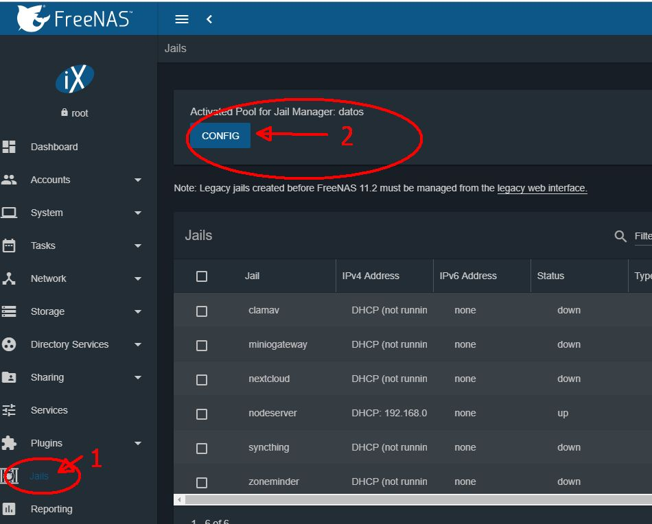
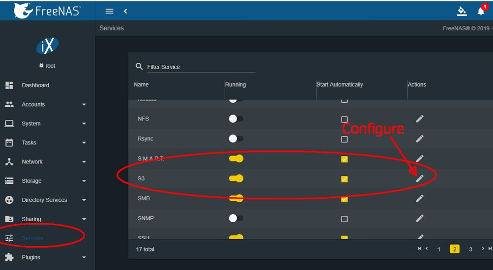
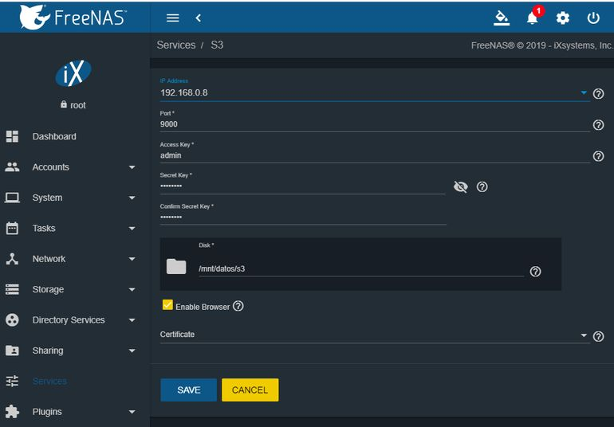
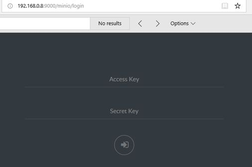
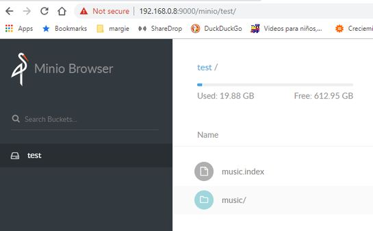
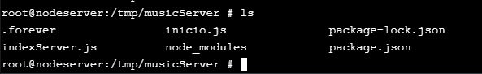
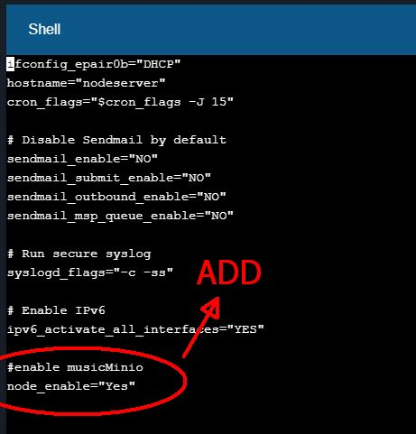
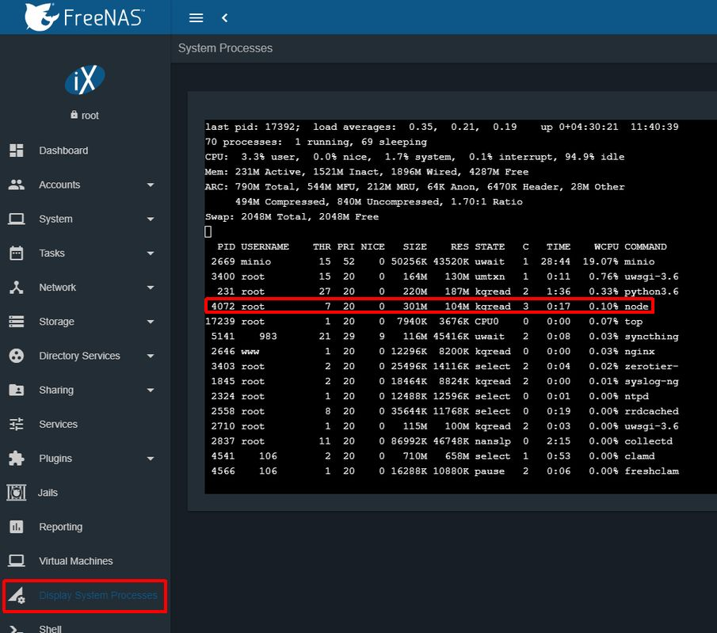

## Notes: Configuration of a Minio server in a freenas

**Freenas**  ( https://freenas.org/ ) is an opensource operating system based in a Freebsd operating system that you can use to host a Minio instance. In the version 11.2-U3 you can start a Minio instance as a service, you don't have to create aditional VM or Jail to start Minio.

I have an old machine that I use for my Freenas server.

The specs for my freenas box are:

Intel core 2 Quad CPU Q9450 @2.66GHz (4 cores)

8 GB RAM

2x1TB HDs in mirror for data as a ZFS Pool

Remember that you need to have a Pool for Jail Manager Activated

To activate Minio as a Service

### Go to Services for configuration and Start S3.

### In configuration check that you have a valid Ip Address, could be the same that you use for accesing console

Once you start S3 service (Minio) you can go to a web browser an go to **IPADDRESS:9000** that get you to:

You can use the Minio Browser to put the Music Library (Bunch of .mp3 files) in a new Bucket

------------

## Notes: Configure your freenas to start a nodejs program in a jail using Foreverjs

The idea is that Nodejs program is in a jail that is run automatically each time that your machine is started.

1. Create a Jail in your Freenas server. (The jail needs a IP) normal Jail no special requirements.
2. Install node.  ( https://computingforgeeks.com/how-to-install-node-js-10-lts-npm-on-freebsd-12/ )
3. Install forever

**npm install forever -g**

4. Configure the service in forever to run automatically each time the jail is started as a service.

    Use the script from (https://github.com/rwestlund/node-rc)

    I create a file named **musicminio** in /usr/local/etc/rc.d with the content in the file you can check in [musicminio](/freenas/musicminio)

    Check that have execution rights.

    **ls -l**

    to enable execution rights run:

    **chmod 777 musicminio**

    copy the program files (*.js , *.json) from this repository to: /tmp/musicServer (this is your working directory for this program)

    

    You can see inicio.js, indexServer.js and package.json

    Run **npm install**

    You can see the creation of **node_modules** directory.

    Then enable the service to run.

    **vi /etc/rc.conf**

    You need to add the line

 

To check that the service you have to go to the path **/usr/local/etc/rc.d/**

Then run the command:

**service musicminio start**

Check that if you copy a .mp3 file to your minio server the index gets recreated.

Also you can check that the service is running going to **Display System Process** in Freenas console

------

